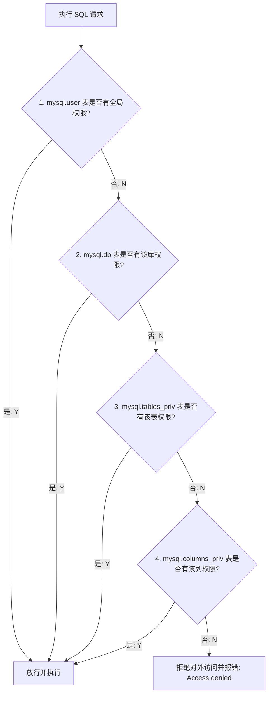

# 🚀 Go 后端数据库面试精华指南（一）

---

## 📌 目录
- [45. 数据库三大范式是什么？](#45-数据库三大范式是什么)
- [46. MySQL 中与权限相关的表有哪些？](#46-mysql-中与权限相关的表有哪些)
- [47. MySQL 的 binlog 有几种录入格式？分别有什么区别？](#47-mysql-的-binlog-有几种录入格式分别有什么区别)
- [48. MySQL 支持哪些常见的数据类型？](#48-mysql-支持哪些常见的数据类型)
- [49. MyISAM 索引与 InnoDB 索引有什么区别？](#49-myisam-索引与-innodb-索引有什么区别)
- [50. InnoDB 存储引擎的 4 大核心特性是什么？](#50-innodb-存储引擎的-4-大核心特性是什么)
- [51. 什么是索引？其分类和优缺点有哪些？](#51-什么是索引其分类和优缺点有哪些)
- [52. 索引的底层数据结构是什么？为什么选择 B+ 树？](#52-索引的底层数据结构是什么为什么选择-b-树)
- [53. 创建索引时需要注意什么？（索引设计原则与失效场景）](#53-创建索引时需要注意什么索引设计原则与失效场景)
- [54. 创建与删除索引有哪几种方式？在线上大表操作时要注意什么？](#54-创建与删除索引有哪几种方式在线上大表操作时要注意什么)

---

### 45. 数据库三大范式是什么？

> [!TIP]
> **核心回答：**
> 三大范式（Normal Forms, NF）是关系型数据库设计的核心规范，旨在**减少数据冗余**和**消除数据异常**（插入、更新、删除异常）：
> 1. **第一范式 (1NF)**：列不可再分，确保属性的**原子性**。
> 2. **第二范式 (2NF)**：在满足 1NF 的前提下，消除非主属性对主键的**部分依赖**（一张表只说一件事）。
> 3. **第三范式 (3NF)**：在满足 2NF 的前提下，消除非主属性对主键的**传递依赖**（非主属性不能“隔山打牛”）。
> 
> *关系逐层递进：满足 3NF 必须先满足 2NF，满足 2NF 必须先满足 1NF。*

#### 一、 第一范式（1NF）：原子性（列不可再分）

要求表中的每一列都必须是不可再分的最小原子单元，即列中不能包含多个值、集合或数组。

##### ❌ 反面教材（不满足 1NF）
设计一张钱包用户表 `User_Wallet`：

| 用户ID (ID) | 用户名 (Name) | 钱包资产信息 (Wallets) |
| :--- | :--- | :--- |
| 1 | Alice | ETH: 2.5, SOL: 10 |
| 2 | Bob | SUI: 500 |

- **问题**：`钱包资产信息` 列包含了代币名称和数量，且一条记录存了多个资产，不具备原子性。当想查询“谁持有 SOL”时，无法直接筛选，必须进行模糊字符串检索，性能极差。

##### ✅ 规范改造（满足 1NF）
拆分列，使每一列都变为单一的基础数据类型：

| 用户ID (ID) | 用户名 (Name) | 代币符号 (Symbol) | 持仓数量 (Balance) |
| :--- | :--- | :--- | :--- |
| 1 | Alice | ETH | 2.5 |
| 1 | Alice | SOL | 10 |
| 2 | Bob | SUI | 500 |

---

#### 二、 第二范式（2NF）：消除部分依赖（一行只表达一件事）

在满足 1NF 的前提下，非主键列必须**完全依赖**于主键，而不能只依赖于主键的一部分（主要针对联合主键）。一张表应该只表达一件核心的事情，不要混杂不相干的主体。

##### ❌ 反面教材（不满足 2NF）
在上面满足 1NF 的表里，由于一个用户可以拥有多种代币，主键必须为联合主键 `(用户ID, 代币符号)`。
- **问题**：`持仓数量` 完全依赖于 `(用户ID, 代币符号)`，但是 `用户名 (Name)` 仅仅依赖于 `用户ID`，与 `代币符号` 毫无关系。这称为部分依赖。
- **引发的异常**：
  1. **数据冗余**：如果 Alice 有 100 种代币，用户名 "Alice" 会被重复存储 100 次。
  2. **删除异常**：若 Bob 清仓了所有的 SUI，删除该行记录时，Bob 的用户信息也从系统里彻底消失了。

##### ✅ 规范改造（满足 2NF）：垂直拆分
将部分依赖的字段剥离，拆分为两张表：

**表 A：用户信息表 Users**（主键：`用户ID`）

| 用户ID (ID) [PK] | 用户名 (Name) |
| :--- | :--- |
| 1 | Alice |
| 2 | Bob |

**表 B：钱包资产表 Wallet_Balances**（复合主键：`用户ID`, `代币符号`）

| 用户ID (ID) [PK] | 代币符号 (Symbol) [PK] | 持仓数量 (Balance) |
| :--- | :--- | :--- |
| 1 | ETH | 2.5 |
| 1 | SOL | 10 |
| 2 | SUI | 500 |

---

#### 三、 第三范式（3NF）：消除传递依赖（不能隔山打牛）

在满足 2NF 的前提下，非主属性列之间不能存在依赖关系，必须直接依赖于主键，不能存在类似 “A 决定 B，B 决定 C” 的传递依赖关系。

##### ❌ 反面教材（不满足 3NF）
给 `Users` 表增加字段，记录用户所属的团队信息：

| 用户ID (ID) [PK] | 用户名 (Name) | 团队ID (TeamID) | 团队名称 (TeamName) |
| :--- | :--- | :--- | :--- |
| 1 | Alice | T100 | 以太坊先锋队 |
| 2 | Bob | T200 | Solana 冲锋队 |

- **依赖链分析**：`用户ID` 决定 `团队ID`，而 `团队ID` 决定 `团队名称`。导致 `用户ID` $\rightarrow$ `团队ID` $\rightarrow$ `团队名称`，存在传递依赖。
- **引发的异常**：若要新成立一个“Sui 战队 (T300)”，但在没有任何用户加入该战队时，由于主键 `用户ID` 不能为空，战队信息无法存入数据库（插入异常）。

##### ✅ 规范改造（满足 3NF）：再次解耦
将传递依赖的关联移至独立的新表：

**用户表 Users**

| 用户ID (ID) [PK] | 用户名 (Name) | 团队ID (TeamID) |
| :--- | :--- | :--- |
| 1 | Alice | T100 |
| 2 | Bob | T200 |

**团队表 Teams**

| 团队ID (TeamID) [PK] | 团队名称 (TeamName) |
| :--- | :--- |
| T100 | 以太坊先锋队 |
| T200 | Solana 冲锋队 |
| T300 | Sui 战队 |

---

#### 四、 生产环境潜规则：反范式设计（Denormalization）

> [!NOTE]
> 在实际的大规模高性能链下后端开发中，通常不会盲目死守第三范式。范式拆得越深，表就越多，查询时就需要进行大量的 `JOIN`（连表），会疯狂消耗数据库的 CPU 资源。
> 为了追求极致的读取速度，通常会故意违反第三范式，允许少量的数据冗余（例如在资产表中冗余存放用户名），以空间换时间。

---

### 46. MySQL 中与权限相关的表有哪些？

> [!IMPORTANT]
> **核心回答：**
> MySQL 的权限管理采用的是**漏斗式校验机制**。权限数据存放在自带的 `mysql` 系统库中，最核心的 4 张权限表为：
> 1. **`mysql.user`**：控制全局级别（Global）权限。
> 2. **`mysql.db`**：控制数据库级别（Database）权限。
> 3. **`mysql.tables_priv`**：控制表级别（Table）权限。
> 4. **`mysql.columns_priv`**：控制列级别（Column/Field）权限。

#### 一、 核心四大权限表（按粒度从粗到细）

1. **全局级别：`mysql.user` 表**
   - **作用**：记录允许连接服务器的账号以及全局管理权限。
   - **主要字段**：`Host`（允许登录的主机）、`User`（用户名）、`authentication_string`（加密后的密码）以及全局权限字段（如 `Select_priv`、`Insert_priv` 等）。
   - **特点**：如果在此表授权了 `Select_priv`，则用户拥有全库、全表、全列的查询权限。

2. **数据库级别：`mysql.db` 表**
   - **作用**：控制用户在特定数据库上的操作权限。
   - **主要字段**：`Host`、`User`、`Db` 以及该库下的特定权限。
   - **经典场景**：限制 Web3 链下后端账号只能对 `eth_indexer_db` 库进行读写。

3. **数据表级别：`mysql.tables_priv` 表**
   - **作用**：控制用户在特定数据表上的权限。
   - **主要字段**：`Host`、`User`、`Db`、`Table_name`、`Table_priv`。

4. **列（字段）级别：`mysql.columns_priv` 表**
   - **作用**：最细粒度的控制，精确到具体的物理列。
   - **主要字段**：`Host`、`User`、`Db`、`Table_name`、`Column_name`、`Column_priv`。
   - **经典场景**：限制某些敏感列（如 `password_hash` 或 `api_secret`）仅对管理员账号开放，而对普通业务账号不可见。

#### 二、 MySQL 的权限校验原理（漏斗模型）

当客户端向 MySQL 发送一条查询请求（如 `SELECT balance FROM users`）时，底层的权限校验路径如下：



#### 三、 生产环境避坑小贴士

- **同步刷新问题**：直接使用 DML 语句（如 `INSERT INTO mysql.user ...`）强改权限表不会立刻生效，因为 MySQL 在启动时会将权限读入内存缓存。
- **规范做法**：一律使用官方标准 DDL 语句：`CREATE USER`、`GRANT`、`REVOKE`，这些语句执行时会自动同步刷新内存。若强改了系统表，必须执行 `FLUSH PRIVILEGES;` 强刷内存。

---

### 47. MySQL 的 binlog 有几种录入格式？分别有什么区别？

> [!IMPORTANT]
> **核心回答：**
> Binlog（二进制日志）主要用于主从复制与数据恢复。其录入格式有 3 种：
> 1. **`Statement`**：基于 SQL 语句复制。省空间，但动态函数易导致主从不一致。
> 2. **`Row`**：基于行变更物理数据复制。绝对安全，支持 CDC 消费，但大批量修改时日志量极大（**工业界标准/默认推荐**）。
> 3. **`Mixed`**：混合模式。普通 SQL 用 Statement，敏感 SQL（如含动态函数）自动切 Row。

#### 一、 三种 Binlog 格式核心拆解

| 特性维度 | Statement (SBR) | Row (RBR) | Mixed (MBR) |
| :--- | :--- | :--- | :--- |
| **记录内容** | 原始的 SQL 语句文本 | 每一行受影响数据的实际变更（前后数据镜像） | 混合：普通 SQL 用 Statement，不安全 SQL 用 Row |
| **日志文件大小** | 极小 🟢 | 极大（批量操作时） 🔴 | 中等（平滑折中） 🟡 |
| **主从数据一致性** | 存在风险（不可靠） 🔴 | 绝对安全（极度可靠） 🟢 | 相对安全（高度可靠） 🟢 |
| **对系统 I/O 的影响** | 极低 | 较高（频繁刷盘） | 中等 |
| **典型场景** | 传统低并发、不含动态函数的系统 | 工业界标准、高并发、金融与 Web3 核心库 | 读多写少、希望兼顾空间与安全的系统 |

- **Statement 的一致性问题**：若 SQL 中包含 `NOW()`、`UUID()`、`RAND()` 等动态函数，主库执行和从库重放得到的结果不同，直接导致主从数据不一致。
- **Row 的绝对精确**：Row 格式记录的是每一行受影响数据的最终修改值，无论 SQL 多复杂，从库都“照猫画虎”填入，100% 保证主从一致。

#### 二、 工业界实战与 CDC 生态（Canal / Debezium）

如果你正在通过 Canal 等中间件消费 Binlog 变更日志，将数据同步到 Redis 或链下大数据中心，**必须将 Binlog 格式强制指定为 ROW**：

```ini
# my.cnf 生产环境配置
[mysqld]
log-bin=mysql-bin
binlog_format=ROW
```

> [!IMPORTANT]
> **为什么 CDC（变更数据捕获）不支持 Statement 格式？**
> 如果用 Statement 格式，Binlog 仅记录 `UPDATE wallet SET status='frozen' WHERE age > 30`。Canal 等链下消费程序只看这句话是无法解析出到底“哪几个钱包地址被冻结了”的。只有开启 ROW 格式，Binlog 才会老老实实吐出具体的行变更镜像（如 ID 1 由 active 变 frozen），下游程序才能精准捕获。

---

### 48. MySQL 支持哪些常见的数据类型？

> [!TIP]
> **核心回答：**
> MySQL 提供了丰富的数据类型，主要分为五大家族：**数值类型**（定点与浮点）、**字符串类型**（定长与变长）、**日期与时间类型**、**布尔与特殊枚举类型**、以及现代的 **JSON 类型**。

#### 一、 数值类型（Numeric Types）

##### 1. 整数类型（精确存储）
所有的整数类型均可通过 `UNSIGNED` 属性使正数范围翻倍。

| 类型 | 占用字节 | 有符号取值范围 | 无符号取值范围 (UNSIGNED) | 工业界典型场景 |
| :--- | :--- | :--- | :--- | :--- |
| **TINYINT** | 1 字节 | -128 到 127 | 0 到 255 | 状态值、代币精度（Decimals）、布尔模拟 |
| **SMALLINT** | 2 字节 | -32,768 到 32,767 | 0 到 65,535 | 状态码、小范围国家代码 |
| **MEDIUMINT** | 3 字节 | 约 $\pm$838 万 | 0 到约 1677 万 | 中等体量统计 |
| **INT / INTEGER** | 4 字节 | 约 $\pm$21 亿 | 0 到约 42.9 亿 | 传统自增 ID、Unix 时间戳、区块高度 |
| **BIGINT** | 8 字节 | 约 $\pm 9 \times 10^{18}$ | 0 到约 $1.8 \times 10^{19}$ | 唯一分布式 ID（雪花算法）、高频流水 ID |

> [!CAUTION]
> **区块链开发痛点：Solidity 中的 `uint256` 怎么存？**
> Solidity 中的 `uint256`（如以太坊大数余额）超出了 `BIGINT` 的容纳极限（最大为 $2^{64}-1$）。在 MySQL 中，**绝对不能**用 `BIGINT` 存大数余额，通用的工业界标准是使用 **`DECIMAL(65, 0)`** 或者直接用 **`VARCHAR(78)`** 字符串存储，在链下应用层再配合 `math/big` 进行运算。

##### 2. 小数类型
- **`FLOAT` (4 字节) / `DOUBLE` (8 字节)**：近似值（浮点数），遵循 IEEE 754 标准，存在经典**精度丢失**问题。严禁用于代币资产或金融相关的数字存储。
- **`DECIMAL(M, D)`**：精确值（定点数），底层以二进制字符串形式存储，绝不丢失精度。`M` 代表总位数（最大 65），`D` 代表小数点后位数（最大 30）。如 `DECIMAL(40, 18)`。

---

#### 二、 字符串类型（String Types）

1. **`CHAR(N)`（定长字符串）**：最大 255 字符。不足部分右侧用空格补齐。物理存储连续，检索极快。适用于长度绝对固定的字段（如 MD5、哈希、以太坊地址）。
2. **`VARCHAR(N)`（变长字符串）**：变长存储，最大 65535 字节。需额外 1~2 字节保存实际长度。极其节省磁盘空间，适用于用户名、邮箱等长度不固定的文本。
3. **`TEXT` 家族**（`TINYTEXT` 到 `LONGTEXT`）：用于存储超长文本（如文章、智能合约源码）。无法设置默认值，排序和索引性能较低。
4. **`BLOB` 家族**：存放二进制数据，如图片、加密文件碎片、编译后的合约 Bytecode。

---

#### 三、 日期与时间类型（Date and Time Types）

| 类型 | 占用字节 | 时间范围 | 格式表现 | 核心特点与区别 |
| :--- | :--- | :--- | :--- | :--- |
| **DATE** | 3 字节 | 1000-01-01 到 9999-12-31 | `YYYY-MM-DD` | 只记录年月日，不包含具体时分秒。 |
| **TIME** | 3 字节 | -838:59:59 到 838:59:59 | `HH:MM:SS` | 记录时间间隔或一天的具体时间。 |
| **YEAR** | 1 字节 | 1901 到 2155 | `YYYY` | 仅记录年份。 |
| **DATETIME** | 8 字节 | 1000-01-01 到 9999-12-31 | `YYYY-MM-DD HH:MM:SS` | 时区无关。你存进去什么时间，读出来就是什么时间。适合跨国独立对账。 |
| **TIMESTAMP** | 4 字节 | 1970-01-01 到 2038-01-19 | `YYYY-MM-DD HH:MM:SS` | 时区相关（底层存储为 UTC 秒数）。会随着数据库服务器所在时区的改变而自动转换显示。缺点是 2038 年会溢出（2038年问题）。 |

---

#### 四、 现代高级数据类型（MySQL 5.7+ / 8.0+）

- **JSON 类型**：原生支持 JSON，校验合法性。允许在 JSON 内部字段上直接建立**虚拟列索引（Virtual Columns Index）**，实现不逊于 NoSQL 的查询效率。
  ```sql
  INSERT INTO user_profile (config) VALUES ('{"theme": "dark", "notifications": {"email": true}}');
  ```

---

### 49. MyISAM 索引与 InnoDB 索引有什么区别？

> [!TIP]
> **核心回答：**
> 它们在底层的物理存储组织方式上有本质区别：
> - **InnoDB 采用“聚集索引”**：主键索引的叶子节点直接存放**真实的整行数据**，辅助索引叶子节点存放的是**主键值**，查询非主键索引时通常需要“回表”二次查找。
> - **MyISAM 采用“非聚集索引”**：索引与数据文件解耦，叶子节点只存储**指向真实数据的物理地址指针**，主键索引与辅助索引结构对等，无回表开销。

#### 一、 主键索引与二级（辅助）索引底层对比

| 索引特性维度 | InnoDB 索引 🟢 | MyISAM 索引 🟡 |
| :--- | :--- | :--- |
| **索引架构分类** | 聚集索引 (Clustered) | 非聚集索引 (Non-clustered) |
| **主键树叶子节点** | 存储该行的完整真实数据 | 存储指向数据文件的物理内存地址指针 |
| **辅助（二级）树叶子** | 存储辅助键值 + 主键值 | 存储辅助键值 + 物理内存地址指针 |
| **回表开销** | 辅助索引查询非索引字段时，必须回表 | 所有索引直接指向数据地址，无需回表 |
| **主键查询性能** | 极高 🟢（一步到位，少一次磁盘 I/O） | 较高（需拿着指针去数据文件换数据） |
| **辅助查询性能** | 稍慢（受回表影响） | 较快且平稳（不受回表影响） |
| **索引文件开销** | 较大（主键树大，辅助树携带主键） | 较小（结构非常紧凑和纯粹） |

##### 1. InnoDB 的聚集索引寻址：
```plaintext
[辅助索引检索: wallet_address = '0xabc...']
              │
              ▼
    找到对应的叶子节点，获取主键 ID (如 ID = 10)
              │
              ▼
[主键索引检索 (回表): ID = 10]
              │
              ▼
    找到主键叶子节点，获取整行完整数据 (ID, Name, Balance)
```

##### 2. MyISAM 的非聚集索引寻址：
```plaintext
[任何索引检索 (主键或辅助)]
              │
              ▼
    找到对应的叶子节点，获取数据物理地址指针 (如 0x7ffffffaa2d0)
              │
              ▼
    直接去 .MYD 数据文件中提取整行数据 (无跨树回表)
```

#### 二、 对生产调优的指导意义

1. **InnoDB 主键为什么推荐用自增 ID，不推荐用 UUID / TxHash？**
   由于 InnoDB 的数据紧密依附在主键 B+ 树上。若使用自增 ID，每次写入都是顺序追加到最右侧叶子节点，结构极其稳定。若使用 UUID 或 Hash 等随机散列值，会导致新数据随机插入到 B+ 树中间，频繁触发**页分裂（Page Split）**与物理行挪移，产生大量磁盘碎片，重挫写入性能。
2. **利用“覆盖索引（Covering Index）”消除回表**
   若 InnoDB 的辅助索引包含查询所需的全部列，则无需回表：
   ```sql
   -- 🚀 极速：假设 wallet_address 有索引。因为索引树上自带了主键 id，直接返回，避免回表。
   SELECT id FROM users WHERE wallet_address = '0xabc...';
   ```

---

### 50. InnoDB 存储引擎的 4 大核心特性是什么？

> [!IMPORTANT]
> **核心回答：**
> InnoDB 支撑起高并发和事务安全，主要靠底层四大核心优化特性：
> 1. **插入缓冲 (Change Buffer)**：合并非唯一辅助索引的随机写为顺序写，提升写入速度。
> 2. **二次写 (Doublewrite Buffer)**：解决操作系统部分页写失效问题，防物理断电损坏。
> 3. **自适应哈希索引 (AHI)**：动态监控热点 B+ 树页面，将其自动升级为 $O(1)$ 哈希查询。
> 4. **预读 (Read-Ahead)**：提前异步将可能访问的连续数据页读入内存 Buffer Pool，消除 I/O 等待。

#### 一、 插入缓冲（Insert Buffer / Change Buffer）

- **解决痛点**：若数据表有大量辅助索引，插入新数据时，辅助索引的物理位置往往是随机离散的，会带来大量昂贵的磁盘随机 I/O。
- **运作机制**：当更新未缓存在内存中的非唯一辅助索引时，InnoDB 不会立刻读写磁盘，而是将修改暂存至内存的 `Change Buffer` 中。当后续触发该页读取或数据库空闲时，再将其合并（Merge）并写入磁盘。

#### 二、 二次写（Doublewrite Buffer）

- **解决痛点**：MySQL 页是 16 KB，而操作系统一页是 4 KB。如果在往磁盘写一个 16 KB 数据页时发生断电，可能只写了部分（如 8 KB），造成“部分写失效（Partial Page Write）”的损坏页，导致物理损坏，此时连 Redo Log 也会因原页损坏而失效。
- **运作机制**：
  ```plaintext
  [内存脏页] ──1.全量拷贝──> [内存 Doublewrite Buffer]
                                     │
                                2.顺序写入 (Sequential I/O)
                                     │
                                     ▼
                        [磁盘共享表空间 Doublewrite 区域]
                                     │
                                3.离散写入 (Random I/O)
                                     │
                                     ▼
                        [真正的数据文件 .ibd]
  ```
- **崩溃恢复**：若在第 3 步写入真正数据文件时断电，重启后 InnoDB 会直接去磁盘的 Doublewrite 区域复制干净完整的原页副本进行覆盖，然后再用 Redo Log 重做。

#### 三、 自适应哈希索引（Adaptive Hash Index, AHI）

- **运作机制**：InnoDB 默默监控查询。如果发现某个 B+ 树索引页或查询条件（如 `WHERE wallet_address = '0xabc...'`）被连续高频读取（例如连续相同条件读取 100 次以上），它会在内存中自动为该页建立一个哈希索引（AHI），使查询绕过 B+ 树的多次寻址探测，直接达到 $O(1)$ 速度。

#### 四、 预读（Read-Ahead）

- **线性预读**：若顺序读取一个区（Extent，64个连续页）的页数超过设定阈值（默认 56），InnoDB 判定为顺序全表扫描，会异步提前把下一个区的所有页全读入内存。
- **随机预读**（已默认关闭）：若发现一个区中大多数页已被缓存在内存，则将剩下未被缓存的页一并读入。

---

### 51. 什么是索引？其分类和优缺点有哪些？

> [!TIP]
> **核心回答：**
> **索引（Index）的本质是：帮助数据库高效获取数据的一种排好序的数据结构。**
> 它的物理形态是一棵排好序的 B+ 树。相当于一本书的**目录**。
> - **优点**：大幅缩短数据检索时间，将复杂度由 $O(N)$ 降至 $O(\log N)$；通过索引树天然的有序性，消除 `ORDER BY` 排序的开销。
> - **缺点**：占用物理磁盘空间（空间成本）；每次 `INSERT`、`UPDATE`、`DELETE` 时需要实时调整 B+ 树的平衡，重挫写入性能（维护成本）。

#### 一、 索引的核心分类

1. **物理存储维度**
   - **聚集索引 (Clustered Index)**：索引键值和真实数据行死死绑定在一起。一张表必须且只能有一个聚集索引（默认是主键）。
   - **非聚集索引/辅助索引 (Secondary Index)**：叶子节点仅存储索引字段值与对应的主键 ID。
2. **业务逻辑维度**
   - **主键索引 (Primary Key)**：唯一且不允许为 NULL。
   - **唯一索引 (Unique Index)**：限制列值必须唯一，但允许包含 NULL 值。
   - **普通索引 (Normal Index)**：无任何约束，纯粹为了查询提速。
   - **联合索引 (Composite Index)**：由多个字段组合建立的单个索引，遵循**最左匹配原则**。

---

### 52. 索引的底层数据结构是什么？为什么选择 B+ 树？

> [!IMPORTANT]
> **核心回答：**
> MySQL InnoDB 选择 **B+ 树 (B+ Tree)** 作为索引的底层结构。它是从哈希表、二叉树、B 树等数据结构演进并筛选出来的最佳结果。选择 B+ 树的核心原因在于**磁盘 I/O 极其可控**且**支持高效的范围查询**。

#### 一、 为什么不选择其他经典数据结构？

1. **不选哈希表（Hash）**
   - **原因**：哈希表的单行等值查询是 $O(1)$，但其**无法支持范围查询**（如 `WHERE id > 100`）。B+ 树因为叶子节点天然有序且通过双向链表相连，区间扫描极其高效。
2. **不选红黑树 / 自平衡二叉树（AVL）**
   - **原因**：树太高了。每个节点最多只能有两个分叉。对于千万级的数据，树的高度在 $\log_2(10^7) \approx 24$ 层左右，意味着单条查询最多可能需要 24 次磁盘 I/O。而 B+ 树是多叉平衡树，千万级表高度仅 3~4 层。
3. **不选 B 树（B-Tree）**
   - **B 树的缺陷**：每个节点（包含非叶子节点）都同时存放键值和真实的整行 Data 数据。由于 16 KB 数据页的空间限制，存放了 Data 会导致分叉树大大减少，树高度被迫增加，I/O 次数增多。且 B 树的叶子节点间没有链表关联，范围查询时必须回溯父节点，非常低效。
   - **B+ 树的优势**：非叶子节点仅存键值（不存 Data），腾出大量空间使每个节点可以有上千个分叉，树高降至 3~4 层。所有数据都在叶子节点，且叶子节点间有**双向链表**，支持高效率的区间遍历。

#### 二、 数学推导：B+ 树的高度计算

在 MySQL InnoDB 中，默认数据页为 16 KB。
- 假设主键是 `BIGINT` (8 字节)，指针占用 6 字节。非叶子节点的目录项为 $8 + 6 = 14$ 字节。
- 一个非叶子节点页可存放分叉数为：$16 \times 1024 / 14 \approx 1170$ 个。
- 假设一行真实记录占用 1 KB。一个叶子节点页可存放记录数为：$16 \times 1024 / 1024 = 16$ 条。
- **树高度与承载数据量推导**：
  - **高度为 2**（1层目录 + 1层数据）：可容纳 $1170 \times 16 \approx 18,720$ 条。
  - **高度为 3**（2层目录 + 1层数据）：可容纳 $1170 \times 1170 \times 16 \approx 21,902,400$（约 **2200 万**）条记录！
- **结论**：千万级数据表的查询，在最坏情况下也仅仅只需要 3 次磁盘 I/O，这就是 B+ 树矮胖结构的威力。

---

### 53. 创建索引时需要注意什么？（索引设计原则与失效场景）

> [!IMPORTANT]
> **核心回答：**
> 创建索引时，必须在“查询效率”与“写开销、空间开销”之间寻找平衡点。必须严格遵循“三建三不建”原则，掌握联合索引的“最左匹配守则”，并全力避开导致索引失效的隐式代码雷区。

#### 一、 索引设计的“三建三不建”原则

##### 1. 哪些列「优先」建立索引？（雪中送炭）
- **WHERE 查询条件字段**：经常作为过滤条件的列。
- **JOIN 关联键**：用于多表连接的列（如外键 ID）。
- **ORDER BY / GROUP BY 字段**：利用 B+ 树的天然有序性，直接免去在内存中进行 `Filesort` 的开销。

##### 2. 哪些列「坚决不建」索引？（降本增效）
- **离散度（区分度）极低的列**：如 `gender`（性别，只有男女）。若区分度过低，MySQL 评估后会认为走索引还要频繁“回表”，不如全表扫描，导致索引失效。
- **频繁更新的列**：更新数据时需要实时调整 B+ 树，高频修改（如账户余额、播放量）建索引会引发大量的磁盘 I/O 争抢和锁冲突。
- **玩具表（数据量极小）**：几十行的配置表，一次 I/O 就能扫全表，维护索引得不偿失。

---

#### 二、 联合索引的“最左匹配原则”与三星索引

1. **最左匹配守则**
   联合索引 `INDEX(age, name, status)` 在底层是先按 `age` 排序，在 `age` 相同的情况下再按 `name` 排序。
   - **有效查询**：`WHERE age = 18 AND name = 'Alice'` (命中索引)
   - **有效查询**：`WHERE age = 18` (命中最左列，有效)
   - **无效查询**：`WHERE name = 'Alice'` (失效，跳过了最左侧 `age`，后面字段整体上是无序的)
   - **开发规范**：在设计联合索引时，应将**高频查询且区分度最高**的列放在最左侧。

2. **业内评价指标：三星索引 (Three-Star Index)**
   - **一星（条件匹配）**：将 `WHERE` 条件里等值谓词的所有列，纳入联合索引的最左侧。
   - **二星（排序优化）**：将 `ORDER BY` 后面的排序字段，紧跟在联合索引的后面，彻底消除内存排序。
   - **三星（覆盖索引）**：将 `SELECT` 查询的所有目标字段，也全部塞入联合索引中，触发**覆盖索引**机制，实现 **0 回表**，速度拉满。

---

#### 三、 ⚠️ 避坑指南：导致索引失效的常见场景

在日常编写 SQL 和代码审计时，必须重点拦截以下容易导致索引瞬间报废的行为：

1. **在索引列上进行任何数学运算或函数调用**
   - ❌ **错误**：`WHERE YEAR(created_at) = 2026`（索引失效，全表扫描）。
   - ✅ **正确**：`WHERE created_at BETWEEN '2026-01-01' AND '2026-12-31'`。
2. **隐式类型转换（字符串不加单引号）**
   - ❌ **错误**：`WHERE wallet_address = 0x123`（若该字段是 `VARCHAR` 字符串，不加单引号会导致 MySQL 底层逐行隐式调用 `CAST()` 强转为数字，造成索引失效）。
   - ✅ **正确**：`WHERE wallet_address = '0x123'`。
3. **模糊查询 `LIKE` 以百分号开头（左模糊）**
   - ❌ **错误**：`WHERE name LIKE '%Alice'`（无法走 B+ 树的左前缀检索，索引失效）。
   - ✅ **正确**：`WHERE name LIKE 'Alice%'`（右模糊，正常检索）。
4. **使用 `OR` 条件时，部分列没有索引**
   - ❌ **错误**：`WHERE age = 18 OR score = 100`（若 `score` 没有索引，整个查询的索引都会报废）。

---

### 54. 创建与删除索引有哪几种方式？在线上大表操作时要注意什么？

> [!CAUTION]
> **核心回答：**
> - **创建方式**：有 `CREATE INDEX`、`ALTER TABLE ADD INDEX` 以及在 `CREATE TABLE` 建表时直接声明 3 种方式。
> - **删除方式**：通过 `DROP INDEX` 或 `ALTER TABLE DROP INDEX` 实现。
> - **大表防死锁红线**：在线上拥有千万级、上亿级数据的表上创建或删除索引时，**严禁**直接敲基础 DDL 命令！必须显式加上 `ALGORITHM=INPLACE` 和 `LOCK=NONE` 以启用 **Online DDL**，防止引发全表锁死导致业务中断。

#### 一、 创建索引的 3 种方式

##### 1. 方式 1：使用 `CREATE INDEX` 语句（灵活、语义清晰）
```sql
-- 语法：CREATE INDEX 索引名 ON 表名 (列名);
CREATE INDEX idx_wallet ON users (wallet_address);
```

##### 2. 方式 2：使用 `ALTER TABLE` 语句（功能最全，支持主键）
```sql
-- 1. 添加普通索引
ALTER TABLE users ADD INDEX idx_wallet (wallet_address);

-- 2. 添加唯一索引
ALTER TABLE users ADD UNIQUE idx_email (email);

-- 3. 添加主键索引
ALTER TABLE users ADD PRIMARY KEY (id);
```

##### 3. 方式 3：建表时直接声明（一步到位）
```sql
CREATE TABLE users (
    id BIGINT UNSIGNED AUTO_INCREMENT,
    wallet_address CHAR(42) NOT NULL,
    email VARCHAR(100),
    PRIMARY KEY (id),                -- 声明主键索引
    UNIQUE KEY idx_email (email),    -- 声明唯一索引
    INDEX idx_wallet (wallet_address) -- 声明普通索引
) ENGINE=InnoDB DEFAULT CHARSET=utf8mb4;
```

---

#### 二、 删除索引的方式

```sql
-- 语法 1：使用 DROP INDEX
DROP INDEX idx_wallet ON users;

-- 语法 2：使用 ALTER TABLE
ALTER TABLE users DROP INDEX idx_wallet;

-- 如果是删除主键索引
ALTER TABLE users DROP PRIMARY KEY;
```

---

#### 三、 🛠️ 工业界线上大表变更安全规范（Online DDL）

##### 1. 警惕旧版本的“Copy 锁表”灾难
在早期的 MySQL 版本中，执行创建索引会进行物理 Copy 表操作：
MySQL 在后台建一张临时空表 $\rightarrow$ 逐行复制数据并全表加锁 $\rightarrow$ 期间所有的写入请求（`INSERT`/`UPDATE`）全部阻塞卡死 $\rightarrow$ 替换老表。若数据量过大，该过程耗时数小时，会导致生产环境直接熔断。

##### 2. 现代演进：拥抱 `INPLACE` 与 `NONE` (MySQL 5.6+)
在线上变更大表结构时，业内强制标准是显式指定 Online DDL 控制参数：
```sql
-- 🚀 工业级安全无锁建索引标准写法
ALTER TABLE users ADD INDEX idx_wallet (wallet_address),
ALGORITHM=INPLACE,
LOCK=NONE;
```
- **`ALGORITHM=INPLACE`**：在原表的物理 `.ibd` 文件中就地重组 B+ 树，无需创建临时表搬迁数据，极大节省磁盘 I/O。
- **`LOCK=NONE`**：在构建索引的长达数分钟甚至数小时的过程中，允许线上业务正常读写（不加任何锁）。中途写入的数据会被存放在 Row Log 缓存区，并在最后合入，真正实现业务无感知升级。

##### 3. 先查再删：防范灰度测试
在删除索引前，应先在表中查阅该索引在运行中是否真的“未被使用”：
```sql
SELECT * FROM sys.schema_unused_indexes WHERE object_schema = 'your_db_name';
```
确认没有被业务调用后，再安全地执行 `DROP`。
